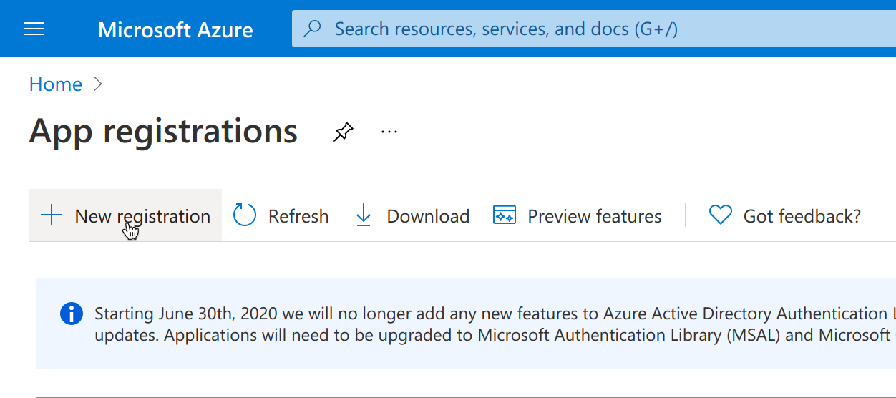
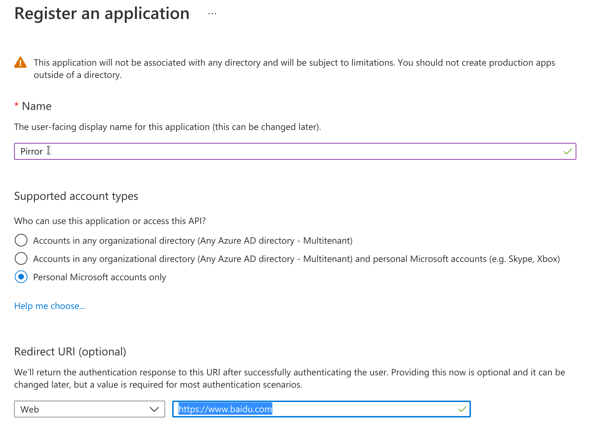
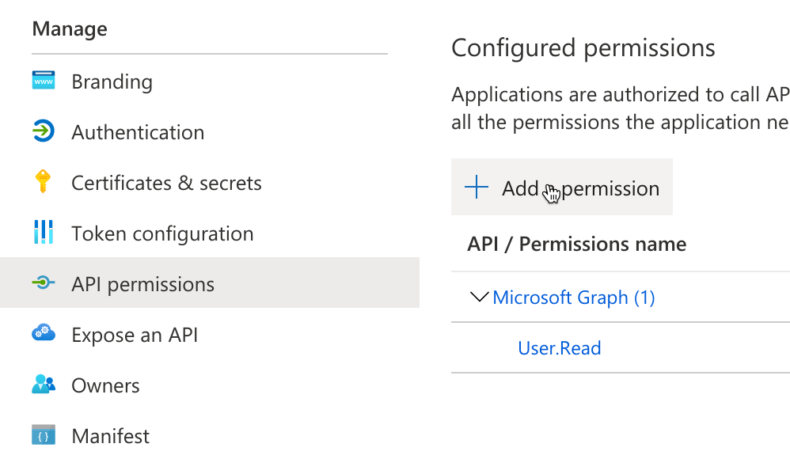
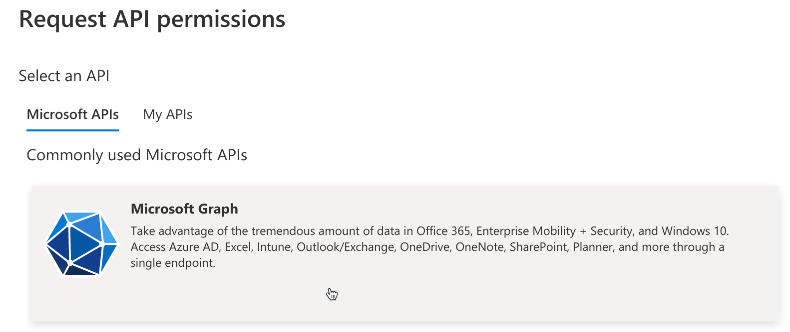
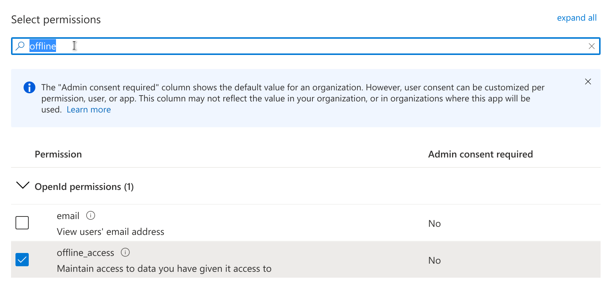
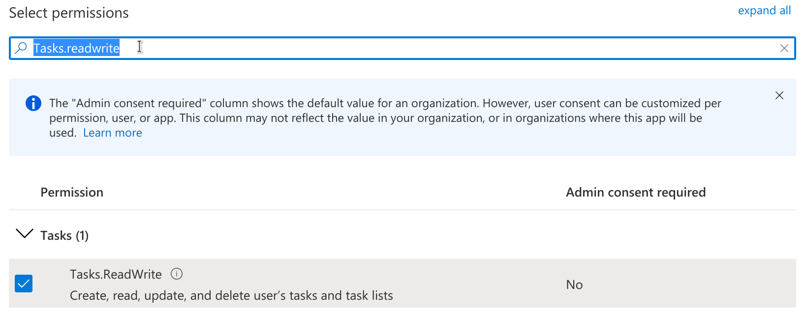
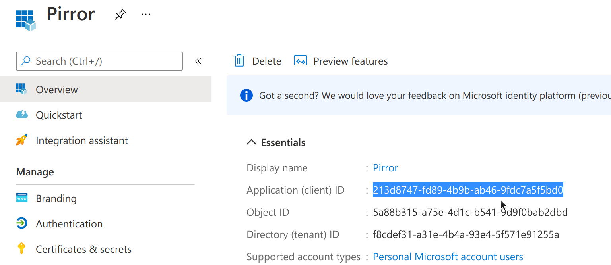
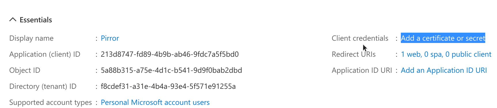
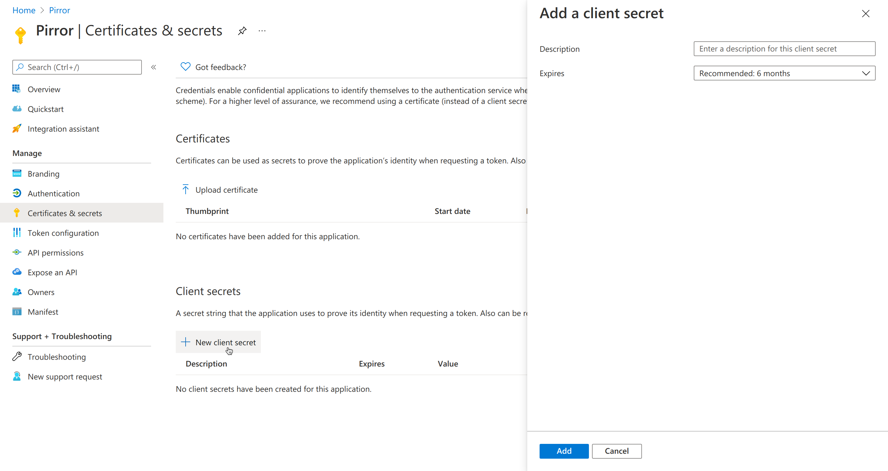
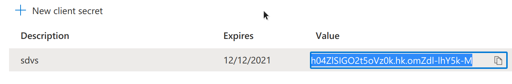

# Pirror
「Pirror」是一个信息集成终端。由于最初是为树莓派平台下的魔镜项目而设计，因此被命名为Pirror（raspberry-**PI** mi**RROR**）。它在@PixelChen24的[「Magirror」](https://github.com/PixelChen24/Magirror)项目基础上，完全重构了「Magirror」的代码结构，以一种更简洁、扩展性更强、部署更加便捷的形式进行构建。

∨1.0.0版本的界面如下所示
<center>

</center>

「Pirror」目前支持以下可以呈现在屏幕上的组件（Widget）
+ **时间组件**：当前时间，形式为`小时：分钟`
+ **万年历组件**：农历+节气信息
+ **课程表组件**
+ **天气组件**：当前气温、天气状况、AQI、UV指数、湿度、气压和未来12小时的天气变化趋势
+ **代办列表组件**
  + Microsoft To Do代办事项: app上添加的代办事项将会以半小时为同步间隔呈现在屏幕上
+ **“一句话”组件**：在屏幕最中央呈现一句有意思的话

## 安装与配置
+ 克隆到本地
```bash
git clone https://github.com/typoverflow/Pirror.git
```
+ 在configs目录下新建`config.yml`文件，将`template.yml`中的内容复制过去。此时，你需要在`config.yml`中额外填写一些配置。
  + 组件开关
    ```yml
    widgets: 
        class_table: True
        weather: True
        todo_list: True
        sentence: True
        date: True
    ```
    将不想开启的组件填写为False即可
  + 和风天气API Key。本项目使用和风天气的API提供实时天气和天气预报。为此，你需要在[和风天气](https://dev.qweather.com/)注册并获取API密钥。同时，你还需要认证成为个人开发者，才可获取天气预报的API权限。获取后，填写在下面这个地方即可
    ```yml
    weather: 
        API_key:                    # 填写和风天气的API Key
    ```
  + Microsoft To Do Client ID and secret. 目前，对open API提供良好支持的代办清单APP仅有微软To Do应用，因此本项目目前仅支持Microsoft To Do作为代办事项组件的“provider”。由于Microsoft To Do使用Oauth2认证，因此你需要进行如下操作
    + **在Azure portal注册项目**：打开[https://go.microsoft.com/fwlink/?linkid=2083908](https://go.microsoft.com/fwlink/?linkid=2083908)，登录你的微软账户，点击画面中的“New registration”
      
      然后名字一栏填入“Pirror”，在“Redirect URI”填入“https://www.baidu.com”
      
    + **开启项目权限**：在左侧边栏点击“API permissions”，选择“Add a permission”。
      
      在弹出的页面中选择“Microsoft Graph”
      
      在搜索框中搜索“offline_access”，勾选，并点击下方的“Add permissions”
      
      在搜索框中搜索“Tasks.readwrite”，勾选，并点击下方的“Add permissions”
      
      在左侧边栏点击Overview界面，记录下你的“Application (client)ID ”
      
      然后找到右侧的“Client credentials”，点击“Add a certificate or secret”
      
      在页面中点击“New client secret”，然后在右侧的窗口中添加一个secret
      
      记录下secret的值
      
    + **填写config.yml**：在`config.yml`中，将刚刚记录的“Application (client) ID”的值和“secret value”分别填入“Microsoft”栏目下的“client id”和“client secret”，完成！
      ```bash
      microsoft: 
        client_id:                # 填写client id
        client_secret:            # 填写client secret
      ```
+ 安装python环境的依赖
  ```bash
  pip install -r requirements.txt
  ```
+ 运行`main.py`
  ```bash
  python main.py
  ```

## 功能前瞻
1. 在内容切换时，添加淡入淡出动画
2. 添加RSS控件
3. 添加滴答清单的API接口和代办清单组件接口
4. 添加透明背景支持
5. 一句话组件：添加固定句子功能

## 更新日志
+ 2021-06-12: `v1.0.0`
  + 添加了基础控件
  + 更好的logger
