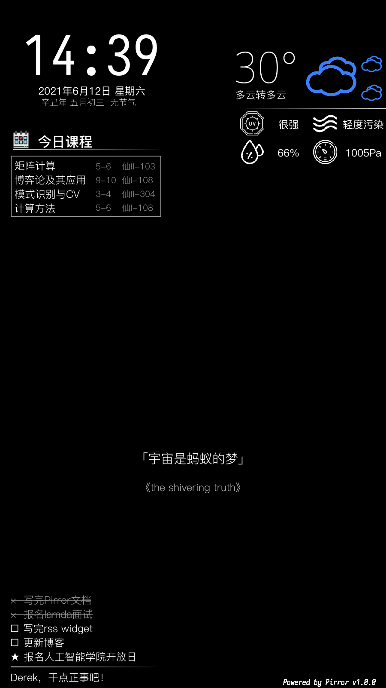
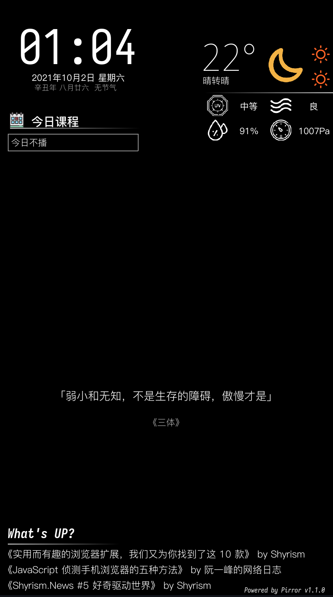
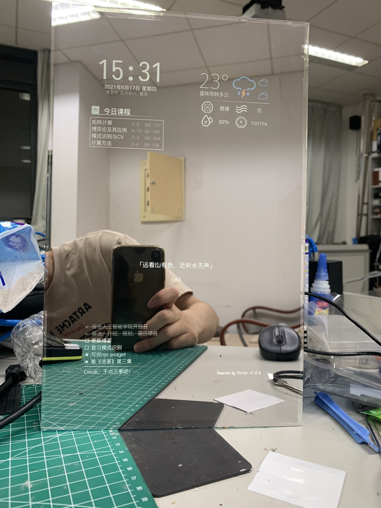
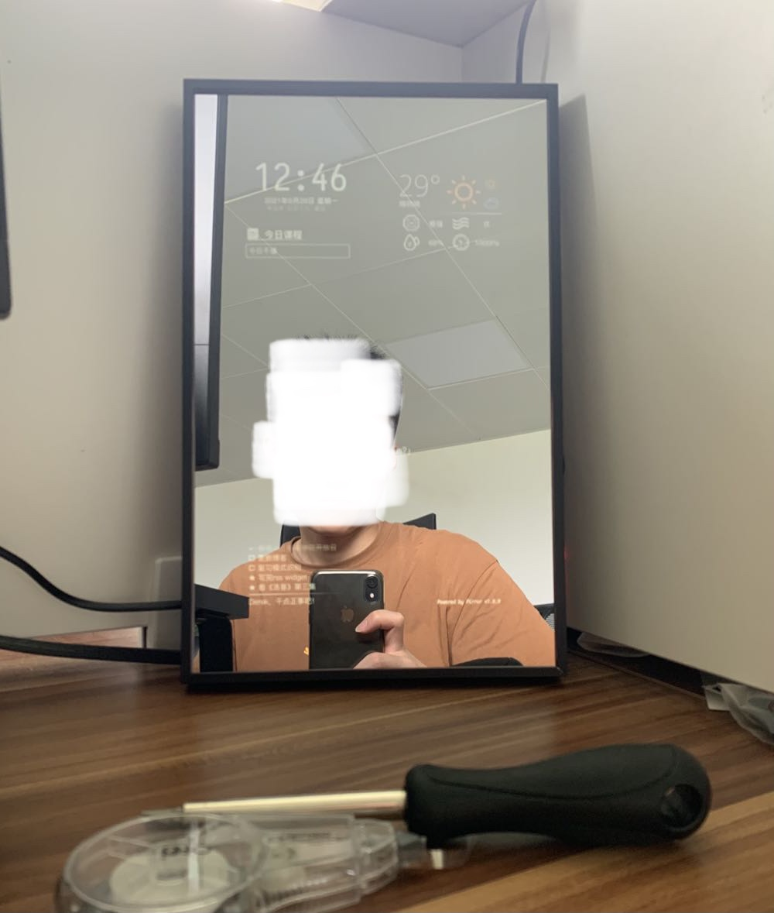

# Pirror
「Pirror」是一个信息集成终端。由于最初是为树莓派平台下的魔镜项目而设计，因此被命名为Pirror（raspberry-**PI** mi**RROR**）。它在@PixelChen24的[「Magirror」](https://github.com/PixelChen24/Magirror)项目基础上，完全重构了「Magirror」的代码结构，以一种更简洁、扩展性更强、部署更加便捷的形式进行构建。

∨1.1.0版本的界面如下所示

  
  

「Pirror」目前支持以下可以呈现在屏幕上的组件（Widget）
+ **时间组件**：当前时间，形式为`小时：分钟`
+ **万年历组件**：农历+节气信息
+ **课程表组件**
+ **天气组件**：当前气温、天气状况、AQI、UV指数、湿度、气压和未来12小时的天气变化趋势
+ **代办列表组件**
  + Microsoft To Do代办事项: app上添加的代办事项将会以半小时为同步间隔呈现在屏幕上
+ **格言组件**：在屏幕最中央呈现一句有意思的话
+ **RSS组件**：使用Tiny Tiny RSS提供的open api，同步（自建）tt-rss服务，在屏幕上呈现尚未阅读的rss推送

作为信息集成终端，「Pirror」并不对使用场景作出假设，你完全可以将它作为后台程序运行，隐藏ui边框，这样你就得到了一个呈现多元信息的**桌面控件**。

但是我们更建议将「Pirror」部署在树莓派平台，作为“魔镜”的显示界面。大致效果如下

  
  

## 安装与配置
请参考[安装教程](docs/tutorial.md)。

## 功能前瞻
1. 在内容切换时，添加淡入淡出动画
2. 添加滴答清单的API接口和代办清单组件接口（如果这两个app能够给出支持良好的API的话）
3. 格言组件：添加固定句子功能
4. 重构绘图逻辑，抽象出widget绘制的位置和size作为配置项

## 更新日志
+ 2021-10-02: `v1.1.0`
  + 添加了RSS widget
+ 2021-06-12: `v1.0.0`
  + 添加了基础控件
  + 更好的logger
