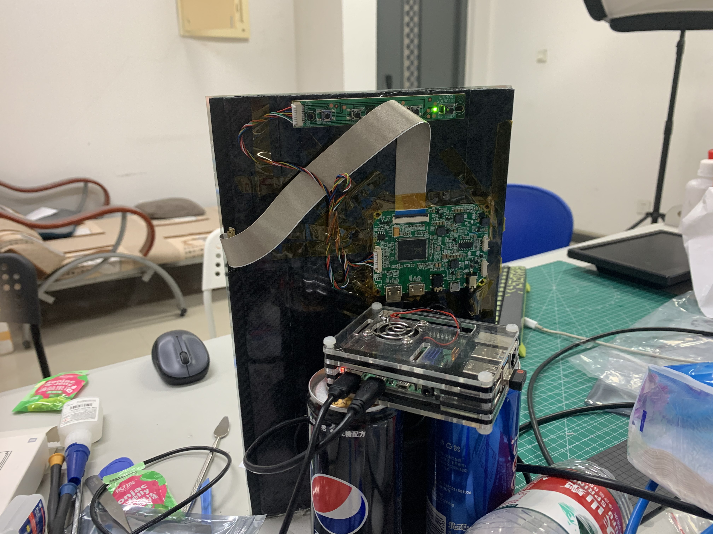

# Install and Deployment
由于「Pirror」仅仅是一个信息集成终端，它依赖大量的第三方服务来实现一些特殊的组件功能。其中绝大多数功能是借助请求服务API的方式实现的。因此，接下来的介绍将会按照如下顺序
1. 如何将Pirror代码部署到本地，并安装所需要的依赖；
2. 如何实现「Pirror」所涉及的各个widget组件的功能；
3. 如何将「Pirror」部署到硬件平台（以树莓派为例）。

## Step 1: Install Pirror
+ 将代码克隆到本地
```bash
git clone https://github.com/typoverflow/Pirror.git
```
+ 安装依赖
```bash
cd Pirror && pip3 install -r requirements.txt
```
+ 在配置好下一节中的widget配置项后，启动Pyrror
```bash
python3 main.py
```

---

## Step 2: Configure Pirror and the Widgets
默认情况下，Pirror会使用`configs/config.yml`文件作为读取的配置文件，你也可以使用`--config`参数指定其他的配置文件
```bash
python3 main.py --config <path to config file>
```

config文件指定了Pirror运行需要的绝大多数参数，你可以从`config/template.yml`复制一份空的配置文件，然后填入需要的参数。本节的剩余部分会对config文件中的参数域进行简短的说明。

### global
```yml
zh_CN: True # 指定语言，默认为中文简体
```

### window
window参数域用于配置渲染出的窗口。
```yml
FPS: 30 # 窗口的渲染频率
width: 900 # 窗口宽度
height: 1600 #窗口高度
background: # 背景图片的路径，缺省则为全黑背景
```

### widgets
widget作用域用于指定需要开启的组件，配置为True表示开启该组件的内容，你需要在接下来的配置中完善该组件所需要的配置项。
```yml
class_table: True
weather: True
todo_list: True
sentence: True
date: True
rss: True
```

### class_table
课程表widget的配置项，见[课程表widget配置](docs/class_table_configuration.md)。

### weather
天气预报widget的配置项，见[天气widget配置](docs/weather_widget_configuration.md)。

### todo list
代办清单widget的配置项，见[代办清单widget配置](docs/todo_list_widget_configuration.md)。

### sentence
“一句话”widget的配置项，见[一句话组件widget配置](docs/sentence_widget_configuration.md)。

### date
万年历widget的配置项。
仅有一个参数，`update_cycle`指定万年历重新渲染的周期（分钟）。

### rss
RSS widget的配置项，见[rss widget配置](docs/rss_widget_configuration.md)。

---

## Step 3: Deploy on Raspberry Pi
+ 首先，为树莓派安装带有桌面环境的Linux系统，这一部分推荐根据官网教程安装Raspbian。系统安装成功后，简单升级软件包。
+ 将树莓派连接便携屏，并将显示角度旋转为纵向。参考这个[教程](https://www.labno3.com/2021/02/03/how-to-rotate-the-screen-of-the-raspberry-pi-2/)。
+ 完成Step1和Step2中的步骤，运行Pirror，出现渲染的窗口。将桌面背景设置为黑色，然后隐藏Pirror窗口的边框，即可部署成功。
+ 在屏幕前安放一块原子镜，即可呈现“魔镜”的效果。


<p float="middle">
  
  
</p>
