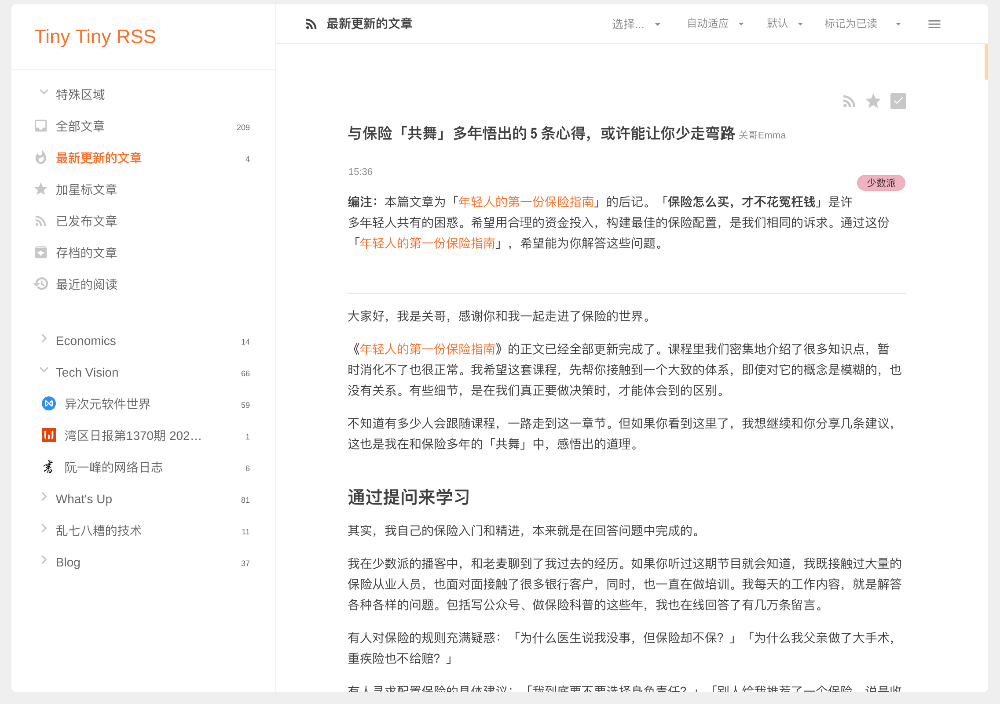

# RSS widget配置
和代办清单一样，RSS也是基于第三方服务的。在目前的实现中，RSS widget与我个人搭建的Tiny Tiny RSS服务http://rss.typoverflow.me进行沟通，实时同步unread推送到Pirror的显示界面上。



关于Tiny Tiny RSS服务的搭建，网络上有很多教程，在此不作阐述；如果你希望在不搭建tt-rss的前提下体验rss widget的功能，可以[申请加入我的tt-rss](mailto:typoverflow@outlook.com)。在你准备好tt-rss后，你可以通过如下配置设置Pirror端的RSS插件
+ `update_cycle`: rss widget更新内容的周期，推荐保持默认配置。
+ `user_name`: tt-rss的用户名。
+ `password`: tt-rss密码
+ `max_entry_num`: 显示的条目数量
+ `focused_categories`: 在Pirror中呈现未读的文章时，仅呈现`focused_categories`所指定的的类别下的文章。

---
一个可以参考的配置文件如下
```yml
rss:
  update_cycle: 10
  server_api_url: **********
  user_name: **************
  password: ****************
  max_entry_num: 3
  focused_categories: 
    - "Tech Vision"
    - "乱七八糟的技术"
    - "Blog"