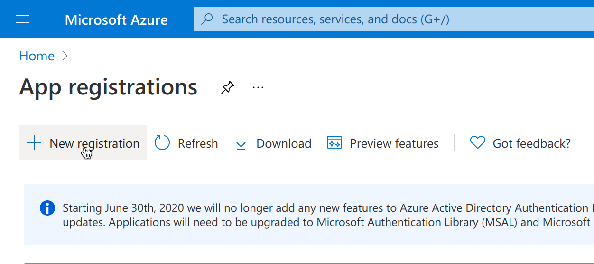
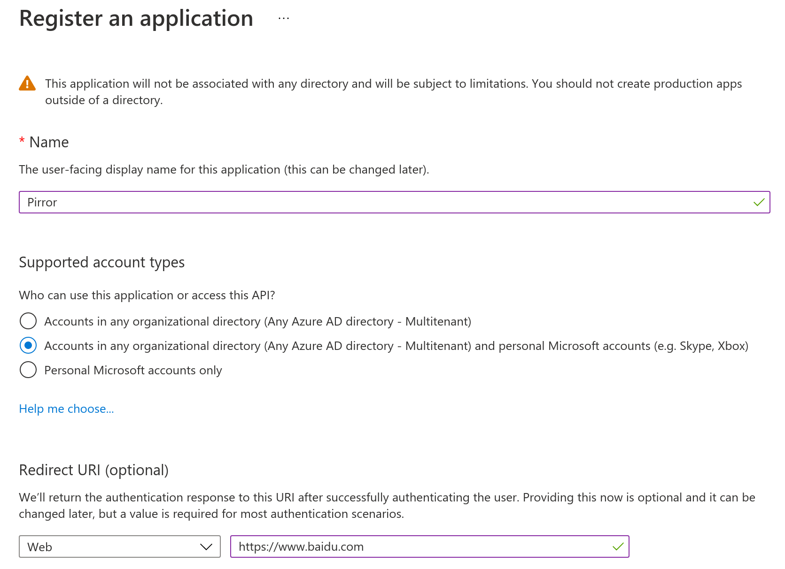
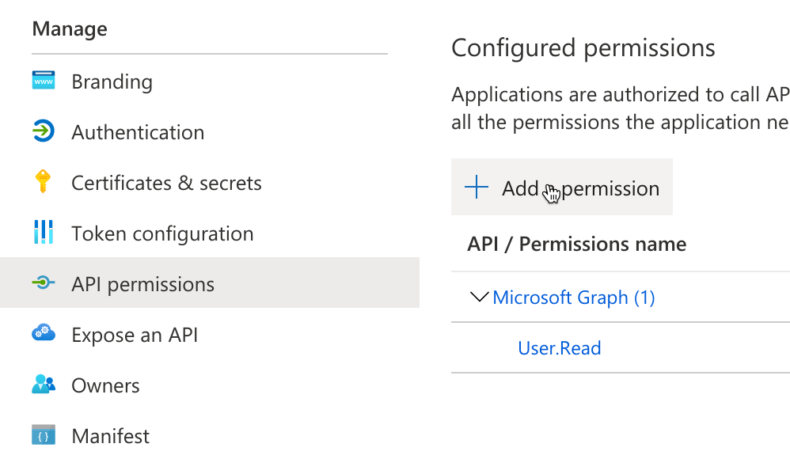
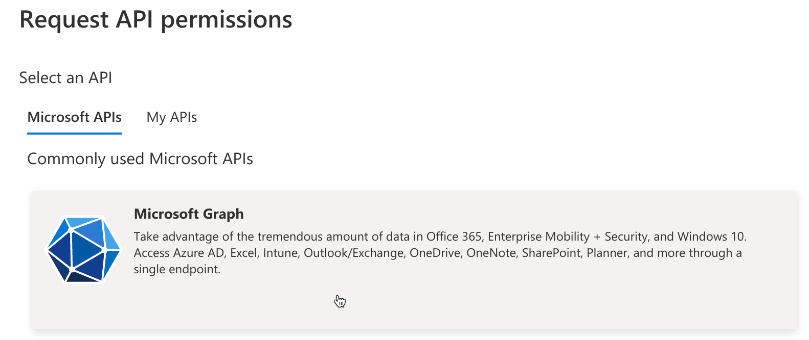
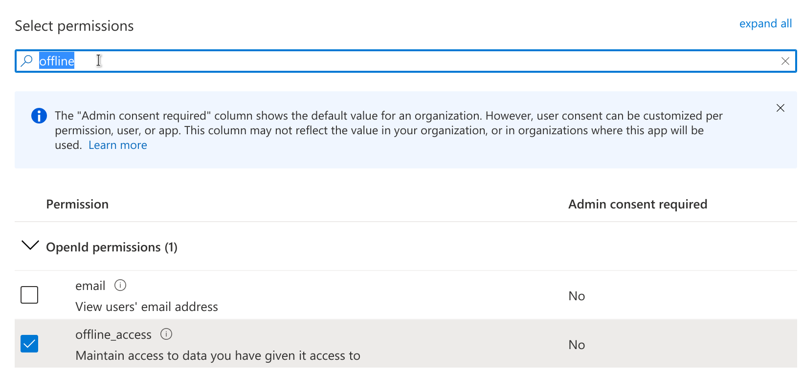
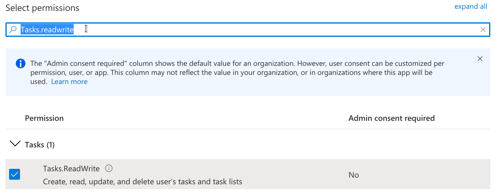
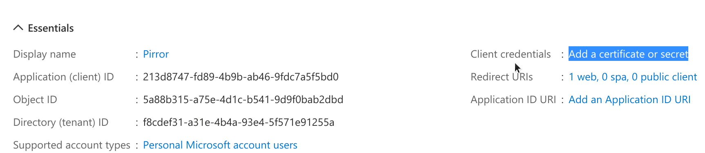
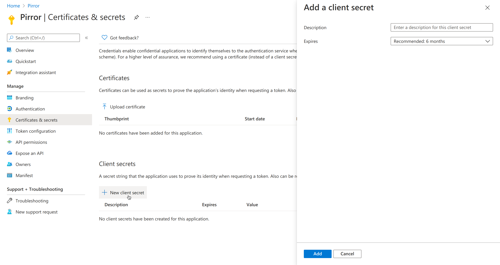
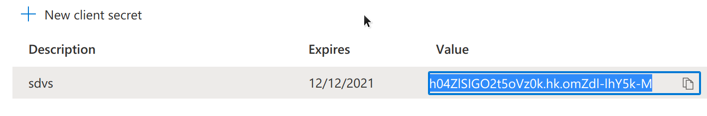

# 代办清单widget配置
Pirror的代办清单服务依然需要借助第三方软件。因为如果不借助第三方的服务，那么就需要在Pirror中内置代办清单功能。这同时也意味着需要为Pirror实现交互。然而，**在Pirror上实现交互是得不偿失的**，因为1.在魔镜中实现交互无论是物料成本还是代码成本都很高；2.带有交互的Pirror有点类似弱化版本的手机，不仅丧失了它作为新型终端的意义，同时也引入了额外的交互时间，违背Pirror“直观地提供必要信息”的初衷。

相反，我们使用Microsoft ToDo作为代办清单的服务提供者。这样你可以在手机端/桌面端添加需要处理的代办事件，而Pirror将会自动地将这些代办事件同步到显示界面上。之所以选择Microsoft ToDo，是因为
1. 它提供了多个平台的APP；
2. 它具备完善的API和文档。

在下面的文档中我们主要阐述如何接入Microsoft ToDo。如果你希望接入其他代办清单服务，请在Issues中提出请求/发送PR。

---
## 获取Microsoft To Do Client ID and Secret
  + 由于Microsoft To Do使用Oauth2认证，因此你需要进行如下操作
    + **在Azure portal注册项目**：打开[https://go.microsoft.com/fwlink/?linkid=2083908](https://go.microsoft.com/fwlink/?linkid=2083908)，登录你的微软账户，点击画面中的“New registration”
      
      然后名字一栏填入“Pirror”，在“Supported account types”中选择“Accounts in any organizational directory (Any Azure AD directory - Multitenant) and personal Microsoft accounts (e.g. Skype, Xbox)”，在“Redirect URI”填入“https://www.baidu.com”
      
    + **开启项目权限**：在左侧边栏点击“API permissions”，选择“Add a permission”。
      
      在弹出的页面中选择“Microsoft Graph”
      
      在搜索框中搜索“offline_access”，勾选，并点击下方的“Add permissions”
      
      在搜索框中搜索“Tasks.readwrite”，勾选，并点击下方的“Add permissions”
      
      在左侧边栏点击Overview界面，记录下你的“Application (client)ID ”
      
      然后找到右侧的“Client credentials”，点击“Add a certificate or secret”
      
      在页面中点击“New client secret”，然后在右侧的窗口中添加一个secret
      
      记录下secret的值
      

## 填写`config.yml`
+ `update_cycle`: 代办清单更新信息的周期，推荐保持默认配置。
+ `provider`:服务提供商，目前仅支持`microsoft`
+ 在服务上的tab下，继续填写
  + `client_id`: 填写上面的步骤中记录的Client ID
  + `client_secret`: 填写上面的中记录的Secret
  + `redirect_uri`: 重定向的uri地址，填写上面的步骤中填写的地址`www.baidu.com`即可
  + `scopes`: 请填写`"Tasks.ReadWrite offline_access"`

---

一个可供参考的配置文件如下
```yml
todo_list:
  update_cycle: 30
  # available providers are "microsoft" for now
  provider: "microsoft"

  microsoft: 
    client_id: *****************
    client_secret: *****************
    redirect_uri: https://www.baidu.com
    scopes: "Tasks.ReadWrite offline_access"
```
